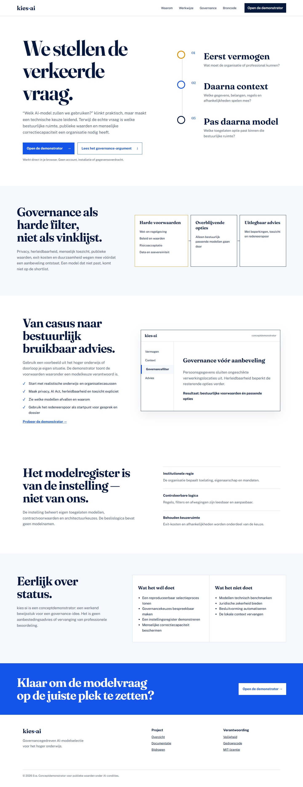
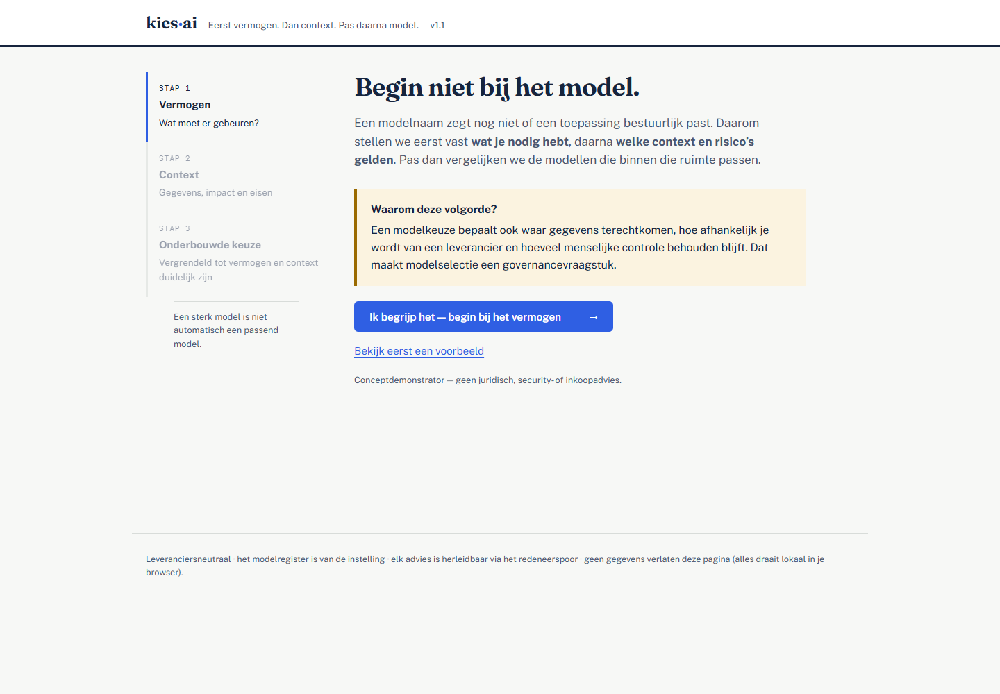
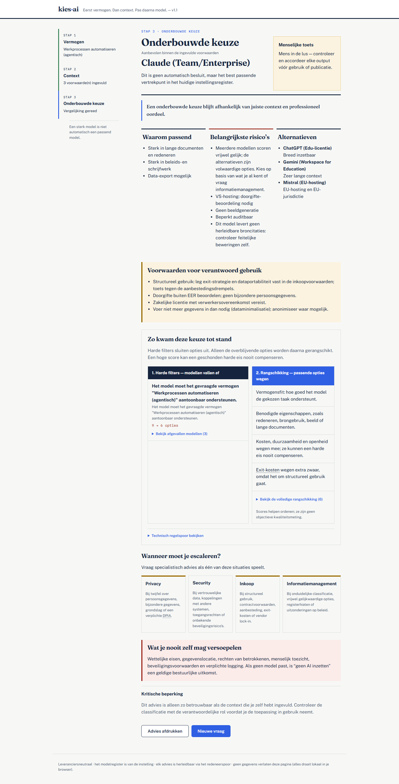

# We stellen de verkeerde vraag.

De vraag *“welk AI-model moeten we gebruiken?”* komt te vroeg.

Een modelkeuze bepaalt waar gegevens terechtkomen, welke leverancier macht krijgt, wat nog controleerbaar is en hoeveel menselijke correctiecapaciteit behouden blijft. Als medewerkers die keuze ieder voor zich maken, decentraliseert de organisatie haar architectuur- en governancebesluiten — meestal zonder dat zo te noemen.

**kies·ai** is een open-source conceptdemonstrator die de volgorde omdraait en bij iedere stap uitlegt wat de bestuurlijke betekenis is:

1. **Eerst vermogen** — wat moet de organisatie, professional of student kunnen?
2. **Daarna context** — welke gegevens, publieke waarden, risico’s en institutionele voorwaarden spelen mee?
3. **Pas daarna model** — welke toegelaten optie past binnen die bestuurlijke ruimte?

[Open de live demonstrator](https://ecmw.github.io/kies-ai/demo/) · [Bekijk de projectsite](https://ecmw.github.io/kies-ai/) · [Lees de verdiepende documentatie](./DOCUMENTATIE.md)



## Waarom dit project bestaat

kies·ai laat zien dat AI-modelselectie geen ranglijst van leveranciers is, maar een vorm van institutioneel ontwerp. Governance werkt daarom als **harde filter vóór de aanbeveling**, niet als toelichting achteraf.

De demonstrator maakt zichtbaar:

- welke vermogensvraag aan de keuze voorafgaat;
- welke modellen door privacy, herleidbaarheid of toezicht afvallen;
- welke menselijke toets bij de toepassing hoort;
- welke risico’s, beperkingen en afhankelijkheden overblijven;
- welk redeneerspoor tot het advies heeft geleid.
- welke modellen door harde filters zijn afgevallen en waarom;
- welke criteria alleen de rangschikking van passende opties beïnvloeden;
- wanneer privacy, security, inkoop of informatiemanagement moet worden betrokken.

Bij iedere contextvraag staat wat de keuze verandert. Begrippen zoals bronherleidbaarheid, exit-kosten en vendor lock-in worden in gewone taal uitgelegd. Het resultaat is nadrukkelijk een **onderbouwde keuze**, geen automatisch antwoord.

Dit maakt het project bruikbaar als gesprekstuk voor onder meer SURF, Npuls, CIO’s, enterprise-architecten, informatiemanagers, bestuurders en professionals in het hoger onderwijs.

## Direct proberen

Open de [live demonstrator](https://ecmw.github.io/kies-ai/demo/) en kies een eigen situatie of een van vijf voorbeeldcasussen:

- zoeken in interne beleidsbronnen met verplichte herleidbaarheid;
- een studentdossier analyseren bij een besluit over een persoon;
- een onderzoeksinterview met bijzondere persoonsgegevens transcriberen.
- een eenvoudige brainstorm zonder gevoelige gegevens;
- structurele workflowautomatisering met aandacht voor exit en dataportabiliteit.

Alles draait lokaal in de browser. Er is geen account, installatie of gegevensoverdracht nodig.



## Wat dit wel en niet is

**Wel:** een werkend bewijsstuk voor capability-first, governancegedreven modelselectie; een transparant referentieontwerp; een uitnodiging om institutionele regie concreet te maken.

**Niet:** een technisch benchmarkplatform, volledige modelcatalogus, juridisch advies, aanbestedingsadvies of automatische besluitvormer.

De opgenomen modellen en regels zijn voorbeelden. Een instelling moet het register, beleid en mandaat zelf beheren en valideren. De uitkomst is bovendien afhankelijk van juiste zelfclassificatie: bij twijfel over persoonsgegevens of besluiten over personen geldt de strengere route of specialistisch advies.

## Het modelregister is van de instelling

[`registry.js`](./registry.js) is bewust gescheiden van [`engine.js`](./engine.js). De beslislogica bevat geen modelnamen. Een instelling kan haar eigen toegelaten modellen, contracten en randvoorwaarden beheren zonder de selectiearchitectuur te herschrijven.

Deze scheiding ondersteunt:

- institutionele autonomie en federatieve samenwerking;
- controleerbare toelating en versiebeheer;
- een geloofwaardige exit-strategie;
- expliciet eigenaarschap van criteria en uitzonderingen.

## Redeneerspoor en publieke waarden

Regels filteren eerst ongeschikte opties. Daarna worden de overblijvende modellen gerangschikt. Elk geactiveerd criterium verschijnt met een regel-ID in het redeneerspoor. De demonstrator behandelt onder meer AVG, AI Act, herleidbaarheid, menselijke toets, exit-kosten en duurzaamheid.

Een redeneerspoor is nog geen rechtmatigheidsoordeel. Het is een controleerbaar beginpunt voor architectuur, privacy, inkoop en bestuur.



## Voor organisaties die willen voortbouwen

1. Fork de repository.
2. Vervang het voorbeeldregister door het instellingsregister.
3. Wijs eigenaarschap toe voor toelating, criteria en uitzonderingen.
4. Valideer regels met privacy, security, architectuur, inkoop en gebruikers.
5. Publiceer wijzigingen en besluiten via versiebeheer.

Zie [CONTRIBUTING.md](./CONTRIBUTING.md) voor bijdragen en [SECURITY.md](./SECURITY.md) voor kwetsbaarheden.

## Projectstructuur

```text
/
├── index.html              landingspagina voor GitHub Pages
├── demo/                   interactieve conceptdemonstrator
├── engine.js               leveranciersneutrale beslislogica
├── registry.js             voorbeeld van een instellingsregister
├── print.html              afdrukbare governancehulpmiddelen
├── DOCUMENTATIE.md         architectuur, kritiek en doorontwikkeling
├── scenarios.md            100 reproduceerbare testscenario’s
├── assets/                 social preview en publieke assets
└── .github/workflows/      Pages-publicatie en kwaliteitscontrole
```

## Lokaal bekijken en toetsen

Voor alleen de demonstrator volstaat het openen van `demo/index.html`. Voor de volledige site:

```sh
python -m http.server 8000
```

Open daarna `http://localhost:8000`.

De governance-scenario’s draaien met:

```sh
node gen-scenarios.js
```

## Status

Versie 1.0 is de eerste publieke conceptrelease. Bekende beperkingen en het voorstel voor verdere ontwikkeling staan in [DOCUMENTATIE.md](./DOCUMENTATIE.md). Tegenspraak is welkom, vooral waar aannames, mandaten en publieke waarden schuren.

## Licentie en verantwoording

Code en documentatie vallen onder de [MIT-licentie](./LICENSE). Gebruik van de demonstrator ontslaat een organisatie niet van eigen juridische, ethische, veiligheids- of governancebeoordeling.
